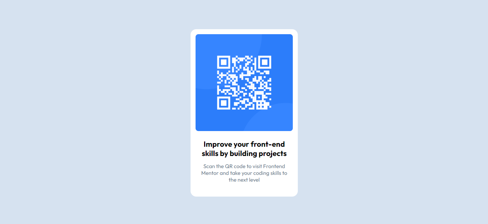

# Frontend Mentor - QR code component

## Welcome! 👋

Thanks for checking out this front-end coding challenge.


## Table of contents

- [Overview](#overview)
- [Screenshot](#screenshot)
- [Links](#links)
- [My process](#my-process)
- [Built with](#built-with)
- [What I learned](#What-I-learned)
- [Useful resources](#useful-resources)
- [Author](#author)


## Overview
This is simple beginner project which helps use to know the structure and building of project. And boost our confidence to do such more projects for further.


### Screenshot




### Links

- Solution URL: [https://github.com/abhi123-rgb/qr-code-component-main/blob/main/index.html]
- Live Site URL: [https://qr-code-abhishek.vercel.app/]


## My process

Initially I gone through the steps provided by frontend mentor. I finished this project just by using the simple HTML and CSS concept. This project build me the confidence and provide knowledge on how to setup the project on locally.


### Built with

- Semantic HTML5 markup
- CSS custom properties


### What I learned

```html
      <div class="qr-info">
        <h2>Improve your front-end skills by building projects</h2>
        <p>Scan the QR code to visit Frontend Mentor and take your coding skills to the next level</p>
      </div>
```
```css
    :root {
      --white: hsl(0, 0%, 100%);
      --slate-300: hsl(212, 45%, 89%);
      --slate-500: hsl(216, 15%, 48%);
      --slate-900: hsl(218, 44%, 22%);

      --para-font-size: 15px;
    }
```


### Useful resources

- [mdn web docs](https://developer.mozilla.org/en-US/docs/Web/CSS/max-width) - This helped to understand the main difference between width and max-width , min-width. This make the website so responsive. 


## Author

- Website - [Abhishek N.M](https://qr-code-abhishek.vercel.app/)
- Frontend Mentor - [@abhi123-rgb](https://www.frontendmentor.io/profile/abhi123-rgb)
- Twitter - [@AbhishekNM90072](https://x.com/AbhishekNM90072?t=BcUfBwBF1rxCxOG3MduVDQ&s=09)


